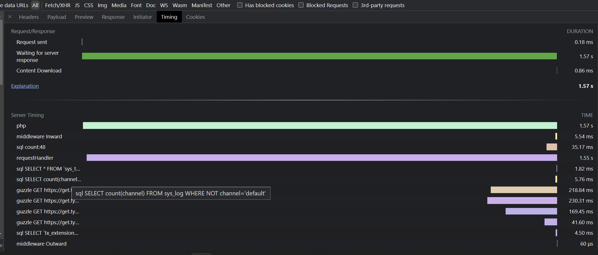

# EXT:server_timing - see your performance



## installation

`composer require kanti/server-timing`

at the moment there is nothing to configure

> Server timings are not displayed in production for users who are not logged into the backend.

## Included measurements:

- `php`: from start of php call to the register shutdown function
- `middleware`: will show how much time was spend in the **inward** and **outward** middleware directions
- `sql`: shows the sql query's
- `mail`: shows the mails that are send (only TYPO3 12)
- `dataP`: Shows the DataProcessors that were executed
- `extbase`: show all Extbase dispatches, (forwards are included in the original action call)
- `guzzle`: external API calls are measured if they use the official TYPO3 `RequestFactory` or the `GuzzleClientFactory`)

> if a measurement key has more than 4 entries, they will get combined into one total time with a count.
> And the 3 longest entries will be kept

## Sentry Profiling

if you have sentry enabled (different Extension eg. `pluswerk/sentry` or `networkteam/sentry-client`) than you can activate the profiling.
- `sentry_sample_rate`
  - if empty ` ` it will keep the setting that was set from the sentry extension.
  - if set to a number like `0.1` it will track 10% of all Requests in sentry.
- `sentry_cli_sample_rate`
    - just like `sentry_sample_rate` but this setting is for the cli calls of the `typo3` binary
- `stop_watch_limit` is set for long-running processes, if you get memory problems you can lower this setting. (default: 100_000)

## Measure your own timings:

### `stopWatch` function (recommended)

````php

  $stop = \Kanti\ServerTiming\Utility\TimingUtility::stopWatch('doSomething', 'additional Information');
  $result = $this->doSomethingExpensive();
  $stop();

````

### `start` & `stop` functions

> this has some limitations, there can only be one `doSomething` at a time.

````php

  \Kanti\ServerTiming\Utility\TimingUtility::start('doSomething', 'additional Information');
  $result = $this->doSomethingExpensive();
  \Kanti\ServerTiming\Utility\TimingUtility::end('doSomething');

````

# TODO List:

## todos:

- more tests

## composer patches needed?

- fluid renderings (possible solution with XClasses?)

## wanted:

- functional tests

## nice to have?

- ViewHelpers
